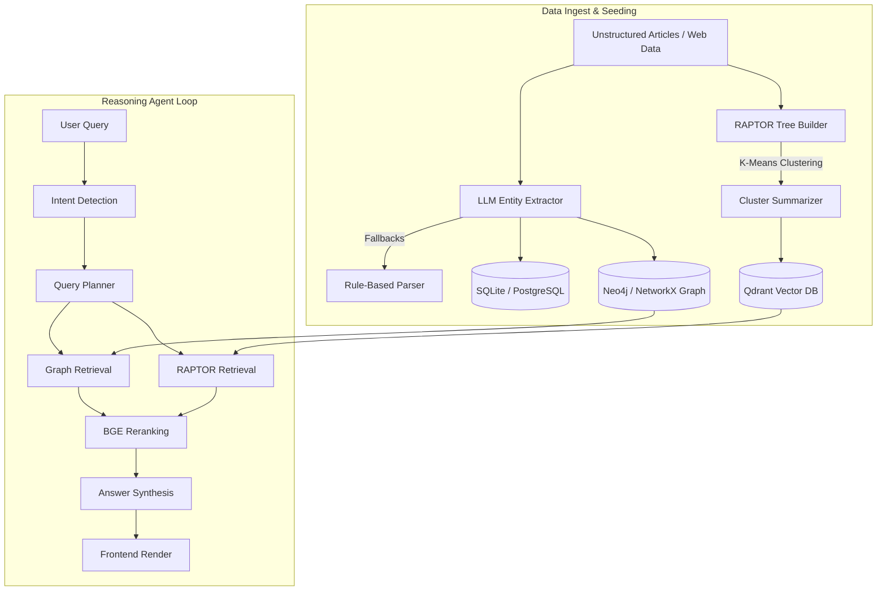

# Startup Intelligence Platform

An AI-powered market intelligence system that continuously maps startup ecosystems, competitor landscapes, funding histories, strategic partnerships, and emerging technologies using a hybrid **GraphRAG + RAPTOR** engine.

---

## 🚀 Key Features & Capabilities

1. **AI Research Agent (Perplexity-Style Chat)**:
   * Multi-hop question answering across unstructured summaries and relationship edges.
   * Visual **LangGraph Node Stepper** showing real-time execution steps of the agent workflow.
   * Interactive citation popups highlighting the exact source document chunks extracted from the RAPTOR vector hierarchy.

2. **Interactive Ecosystem Graph Visualizer**:
   * Canvas rendering using **React Flow**, supporting custom color-coded nodes for Companies, Founders, Investors, Markets, Technologies, and Products.
   * Multi-hop path highlights and relationship label rendering (e.g. `COMPETES_WITH`, `PARTNERED_WITH`, `FUNDED_BY`).
   * Interactive side panel showing node properties and double-click triggers to query and expand a node's 2-hop neighborhood.

3. **Startup Directory & Similarity Engine**:
   * Directory listing of seeded startups with descriptions, categories, funding, and tech stacks.
   * Semantic embedding matching to find similar companies using vector space cosine-distance calculations.

4. **Acquisition Predictor**:
   * Heuristic predictions evaluating relationship density, competitor cluster size, and strategic partnerships with Tier-1 technology companies (e.g., Microsoft, Google, AWS).
   * Visual gauge rings rendering M&A likelihood scores alongside strategic growth factor checklists.

---

## 🛠️ Technology Stack

* **Frontend**: Next.js 16 (App Router), TypeScript, Tailwind CSS v4, `@xyflow/react` (React Flow), Lucide Icons, Framer Motion.
* **Backend**: FastAPI (Python), Uvicorn, LangChain, LangGraph.
* **Database (Hybrid Storage)**:
  * *Vector Search*: **Qdrant** (Local file-storage fallback / Remote Docker Server).
  * *Relational Data*: **SQLite** / **PostgreSQL** via SQLAlchemy.
  * *Relationship Graph*: **NetworkX** / **Neo4j**.
* **AI Models**:
  * *Embeddings*: `BAAI/bge-large-en-v1.5` (1024-dimension vectors).
  * *Reranking*: `BAAI/bge-reranker-large` (Cross-encoder relevance scorer).
  * *Text Generation*: `Mistral-Small-3.1-24B-Instruct` via Hugging Face Inference API.

---

## 📐 System Architecture



### Ingestion & Seeding Engine (RAPTOR)
1. **Hierarchical Summarization**: Document chunks are embedded, grouped using K-Means clustering, and summarized recursively by an LLM. This builds a multi-level tree of contexts (Level 0 raw chunks up to Level 3 global summaries) stored in Qdrant.
2. **Graph Construction**: The ingestion pipeline extracts structured relationships which are written directly to the Neo4j/NetworkX graph representation.

### LangGraph Reasoning Steps
* **Intent Detection**: Classifies the query (e.g., Competitors, Funding, Partnerships).
* **Planner**: Generates research subqueries.
* **Retrievers**: Combines semantic summaries from Qdrant with relationship vectors from Neo4j.
* **Reranker**: Sorts retrieved chunks based on query semantic overlap.
* **Generator**: Merges graph and vector documents to draft the final cited response.

---

## ⚙️ Local Development Setup

### Prerequisites
* Python 3.10+
* Node.js 18+

### 1. Backend Setup
1. Navigate to the backend directory:
   ```bash
   cd backend
   ```
2. Activate the virtual environment:
   ```bash
   source .venv/bin/activate
   ```
3. Run the database seeder script to initialize relational, vector, and graph fallbacks:
   ```bash
   python seed.py
   ```
4. Start the FastAPI backend server:
   ```bash
   python -m uvicorn main:app --host 127.0.0.1 --port 8000
   ```

### 2. Frontend Setup
1. Navigate to the frontend directory:
   ```bash
   cd ../frontend
   ```
2. Install dependencies:
   ```bash
   npm install
   ```
3. Start the Next.js development server:
   ```bash
   npm run dev
   ```
4. Open [http://localhost:3000](http://localhost:3000) in your browser.

---

## ⚙️ Environment Variables & Fallbacks (`backend/.env`)

The system is designed with a **`LOCAL_FALLBACK`** mode, allowing the application to operate fully offline for local development and testing:

```env
LOCAL_FALLBACK=true
HF_API_KEY=hf_mock_placeholder_token
NEO4J_URI=bolt://localhost:7687
QDRANT_HOST=localhost
```

* **When `LOCAL_FALLBACK=true`**:
  * SQLite is used instead of PostgreSQL.
  * Local NetworkX memory-graphs are used instead of a Neo4j server.
  * Local file-based Qdrant client is used instead of a Qdrant Docker server.
  * Embedding and generation requests are automatically mocked using high-fidelity local templates, bypassing network requirements.
* **When `LOCAL_FALLBACK=false`**:
  * The system attempts to connect to live external servers (PostgreSQL, Neo4j, Qdrant Server) and queries the Hugging Face Inference API using your `HF_API_KEY`.
